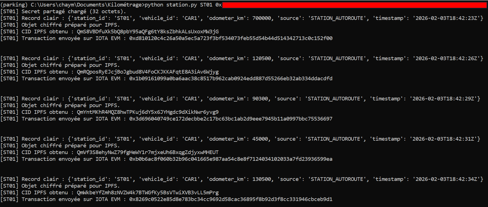
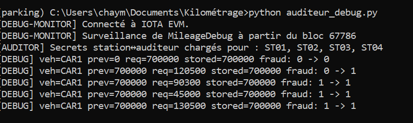

# Mileage Fraud Detection System and Secure Storage of Large Files in IPFS

A complete system for securing vehicle mileage records based on IOTA EVM and smart contracts.

The system enables:

- secure registration of mileage data  
- detection of rollback attempts  
- auditing of inspection stations  
- performance evaluation (gas / latency)  
- storage of large files on IPFS  

---

## Project Organization

blockchain/ → Smart contracts and Hardhat scripts  
keys/ → Cryptographic key management  
generate_keys → Script for generating key pairs  
station → Simulation of an inspection station  
auditeur_debug → Verification and debugging tools  
.env → Local configuration (private)

---

## General Workflow

1. **Key Generation**
   - Generate a Kyber key pair for the auditor  
   - Create a unique shared secret for each station  
   - Produce:
     - one `.pem` file per station  
     - a registry of secrets on the auditor side  

   ### Generated Outputs

   In the `keys/` directory:

   - `ST01_secret.pem`  
   - `ST02_secret.pem`  
   - `ST03_secret.pem`  
   - `ST04_secret.pem`  
   - `auditor_station_secrets.txt`  
   - `auditor_pk.txt`  
   - `auditor_sk.bin`

2. **Blockchain Deployment**
   - Deployment of the MileageLedger contract on IOTA EVM  
   - Retrieval of the contract address  

3. **Station Operation**
   - submission of mileage (and files if available)  
   - local verification  
   - on-chain submission  

   **Fraud Detection**
   - monotonicity check  
   - blocking in case of rollback  
   - immutable traceability  

   

4. **Auditor**
   - Real-time monitoring  

   

---

## Security

- The `.env` file is personal and must not be shared  
- Use testnet accounts only  
- Never publish private keys
