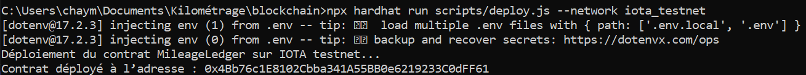

# Odometer Rollback Fraud Detection – Hardhat Project

This repository contains the smart contract and scripts used to detect vehicle mileage rollback fraud on IOTA EVM.

---

## 1. Install Dependencies

After cloning the repository, run:

npm install

This command installs all required packages and recreates the `node_modules` folder.

---

## 2. Compile the Smart Contract

To compile the Solidity contracts, execute:

npx hardhat compile

This command generates the necessary artifacts and cache files.

---

## 3. Deploy on IOTA Testnet

To deploy the contract on the IOTA EVM test network, run:

npx hardhat run scripts/deploy.js --network iota_testnet

The deployed contract address will be displayed in the terminal.

---

## 4. Contract Address After Deployment

After executing the deployment command, the terminal will display a message similar to:

Contract deployed at address: 0x...

⚠ This address is very important.  
It represents the deployed smart contract on IOTA EVM and will be required for:

- interacting with the contract from scripts  
- executing evaluation scenarios  
- verifying transactions on the network  

Make sure to copy and save this address for later use.

---

## Notes

- Create a local `.env` file with your own credentials before deployment.  
- Never share real private keys.  
- Use testnet accounts only.
